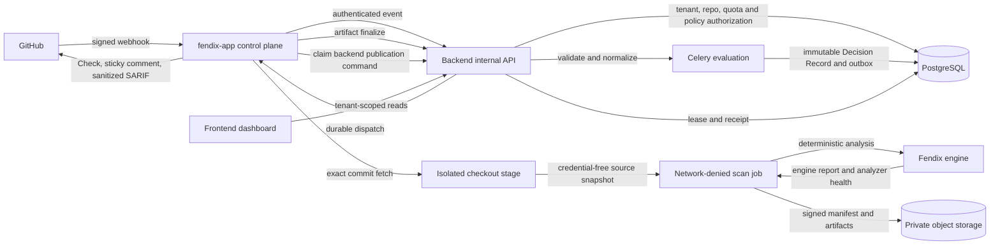
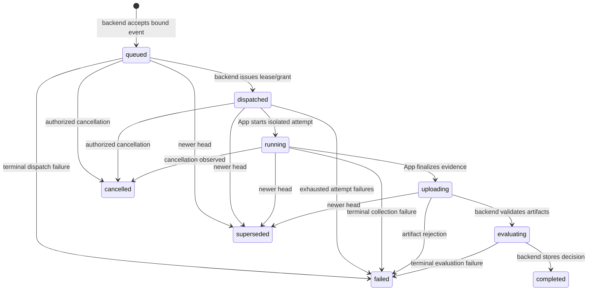

# ADR-009: Backend-authoritative GitHub App integration

## Status

**Superseded by [ADR-010](ADR-010-ci-first-backend-authoritative-integration.md).**

The investigation and rationale in this record are preserved. ADR-010 changes
the first managed delivery path from a hosted GitHub App executor to
customer-controlled CI. A future GitHub App may return as an event, execution,
or publication adapter over ADR-010's shared backend contracts. It may not
become a separate decision authority.

This record is an architecture and implementation plan. It does not authorize a
deployment, release, DNS change, production migration, or public announcement.
The final readiness gates are listed at the end of the document.

Date: 2026-09-21

## Decision summary

Fendix will use one backend-authoritative integration pipeline:

1. GitHub is authoritative for installation, repository, pull request, and commit
   identity.
2. `fendix-app` verifies webhooks, submits normalized events, collects evidence in
   an isolated scan workload, and performs GitHub API mutations only from durable
   backend publication commands.
3. The Fendix engine produces deterministic evidence and analyzer-health output.
   Its finding-level decision fields are inputs and diagnostics; they are not the
   cloud release decision.
4. The backend resolves tenant and repository bindings, authorizes work, ingests
   and correlates evidence, selects versioned policy, calculates the final release
   decision, persists an immutable Security Decision Record, and controls all
   publication.
5. The frontend renders backend records. It never calculates or repairs a security
   decision in the browser.

The current standalone flow remains a legacy compatibility path while the new path
is built behind a per-organization feature flag. One installation/repository may
use only one mode at a time. Dual processing and dual publication are forbidden.

## Scope and non-goals

This decision covers the production integration among the official GitHub App,
engine, Django backend, and Next.js dashboard. The smallest pilot covers selected
GitHub.com repositories and pull-request events.

The following are outside the pilot:

- GitHub Enterprise Server;
- push/default-branch scanning;
- DAST against deployment URLs;
- running customer build scripts;
- self-hosted collectors;
- changing remediation-governance resolution allowlists;
- changing production decision behavior before an explicit rollout approval;
- Kubernetes migration merely because a reference manifest exists.

## Evidence base

The review inspected executable code, tests, migrations, schemas, configuration,
and deployment files at these exact revisions. All worktrees were clean and on
`main` when inspected.

| Component             | Repository                          | Inspected revision                         |
| --------------------- | ----------------------------------- | ------------------------------------------ |
| Engine and GitHub App | `Fendix-app/Fendix`                 | `514cf4074da6549453976afdc7370125567427c0` |
| Backend               | `Abdel-RahmanSaied/fendix-backend`  | `525a76aea3b334719a297a66961443cc27c53dd9` |
| Frontend              | `Abdel-RahmanSaied/fendix_frontend` | `4b679e3aedbda93ab47de6119377429d8c1c2a49` |

This record treats source code as evidence. Marketing pages and release prose were
not used to infer runtime capabilities.

## Current state

### Standalone Go GitHub App

`go/cmd/fendix-app/main.go` runs a long-lived HTTP service with `/webhook` and
`/healthz`. It loads the GitHub App ID, RSA private key, webhook secret, API base,
listen address, and an in-process scan-concurrency limit from environment
variables. It has no backend, database, Redis, queue, tenant, or object-store
configuration.

`go/internal/ghapp/webhook.go`:

- bounds a webhook body at 4 MiB;
- verifies `X-Hub-Signature-256` with HMAC-SHA256 over exact request bytes and
  constant-time comparison;
- rejects missing, malformed, legacy, and mismatched signatures;
- routes `pull_request`, `push`, `check_run`, and `ping` events;
- acknowledges after the handler enqueues work.

`go/internal/ghapp/auth.go` mints an RS256 App JWT with a nine-minute lifetime and
60-second clock-skew leeway, exchanges it for an installation token, and caches
tokens per installation with single-flight refresh. Installation tokens are
treated as expired with less than 30 seconds remaining.

`go/internal/ghapp/handler.go`, `scanner.go`, and `worker.go` implement the current
v3.4.1 flow:

1. decode a GitHub payload;
2. accept `pull_request.opened`, `.synchronize`, and `.reopened`;
3. enqueue an in-memory job with a maximum of two concurrent scans and a queue of
   64 by default;
4. deduplicate only while a matching job is queued or running;
5. acquire an installation token;
6. initialize a repository, fetch the webhook-supplied head SHA with depth one,
   and check out `FETCH_HEAD`;
7. run `fendix scan --code <dir> --format json --output <file>`;
8. run `fendix report` over the JSON to create SARIF;
9. render and post a new PR comment;
10. upload SARIF as a best-effort action.

The source checkout is removed on ordinary return. The scan receives a scrubbed
environment and a platform-dependent sandbox. The installation token is passed to
Git through an `http.extraheader` command argument. That avoids `.git/config`
persistence but remains visible to sufficiently privileged process inspection on
the host. The scan sandbox is best-effort and therefore is not a sufficient
multi-tenant isolation boundary on its own.

`check_run.rerequested` starts another local scan. `push` is currently an
acknowledged no-op. The Go App does not create or update a GitHub Check Run and
does not update an existing sticky comment; it posts a comment and uploads SARIF.

The queue is not durable. A restart loses queued work and its in-flight dedupe set.
A full queue is logged as dropped after the webhook has already received success;
the comment that GitHub will retry is incorrect because a successful webhook
response does not cause automatic redelivery. There is no persisted delivery ID,
attempt, result, or cancellation record.

### Engine output

`go/internal/reporters/json.go` defines JSON report schema version `2`. The report
contains findings, engine metadata, scanner status, coverage, engine policy
version, decision counts, and a release-decision projection. Findings carry stable
fingerprint information, severity, evidence, source, confidence, taint/route data,
corroboration, and finding-level decision rationale.

The engine's evidence, confidence, correlation, and decision packages are
deterministic. They remain the analysis authority for facts produced during the
run. The engine has no tenant policy database and cannot know the currently
published cloud policy, accepted exceptions, organizational feature state, or
backend evidence history. It therefore cannot be the cloud release-decision
authority.

### Backend GitHub path

The backend already contains a separate GitHub App implementation:

- `backend/integrations/models.py` stores `GitHubInstallation`, binding a numeric
  installation ID to exactly one organization, and `GitHubRepoConfig`, keyed by
  installation plus mutable `owner/repo` text.
- `backend/integrations/github_views.py` has a second webhook receiver. It verifies
  the raw HMAC before parsing, resolves the organization through the stored
  installation, and queues a Celery task.
- The install flow uses a signed, expiring, single-use state and requires an
  organization administrator. Its own code documents a remaining production gap:
  without GitHub user authorization, a Fendix administrator can present another
  real installation ID. The backend verifies that an installation exists but does
  not prove that the callback user is authorized for that installation.
- `backend/integrations/tasks.py::scan_pull_request` debits organization quota,
  persists a `Scan`, obtains a GitHub token, clones the exact head SHA, runs the
  same engine wrapper, optionally scans the base commit, diffs fingerprints, and
  creates/completes a GitHub Check Run.
- Its `(organization, repo name, head SHA)` idempotency is application-level. The
  code acknowledges that a rare create race can duplicate work; there is no
  database uniqueness constraint on the event or PR-head identity.
- A failed base scan is treated conservatively as all head findings being new.
  Check publication is best-effort and has no durable publication outbox.

The standalone Go App and Django backend can therefore receive the same logical
GitHub events, run different workflows, and publish different GitHub surfaces.
This conflicts with the required single decision authority.

### Backend scan and decision persistence

The normal backend path is `POST /api/scans` to a persisted `Scan`, then a Celery
`scans` queue, then `FendixEngine`, report parsing, `ScanFinding` persistence, and a
terminal state. URL authorization is rechecked immediately before hosted network
execution. Tasks have soft/hard limits, compare-and-swap the scan from `queued` to
`running`, and reconcile stuck jobs.

`Scan` stores the canonical backend projection in `release_decision`,
`coverage_state`, `decision_policy_version`, and `decision_rationale`. It also
stores engine/report versions and GitHub PR provenance. The backend recomputes its
release decision from normalized scan evidence instead of relying on the browser.
The frontend already renders these stored fields.

This is useful existing behavior, but it is not a dedicated immutable Security
Decision Record. The decision is a mutable projection on a scan row and is not
revisioned with a GitHub delivery, repository immutable ID, complete artifact
digest set, publication receipts, or a durable outbox.

The backend has no generic `Application` or `Project` model. `Organization` is the
tenant. `Asset` is the current first-class target model and supports `repo` as a
kind. A repository integration should bind to an organization-owned repository
`Asset` for the pilot instead of introducing an ambiguous parallel application
hierarchy.

### Existing governed evidence primitives

The remediation-governance subsystem has strong reusable primitives:

- Ed25519 collector principals and dispatch grants;
- exact-byte, size-bounded proof capture;
- tenant/job/nonce/subject binding;
- digest conflict detection and immutable retained proof rows;
- artifact-store registration and validation;
- JSON Schema and exact decimal decoding;
- evidence authority, ordering, state-machine, Jira, and audit models.

The internal route
`/internal/v1/governance/collector-grants/<grant_id>/proofs` accepts at most 1 MiB
per exact JSON proof, requires a dispatch-bound Ed25519 signature, and persists
duplicates or conflicts deterministically.

These controls should be reused as implementation patterns and, where semantics
match, shared infrastructure. The remediation scanner-evidence schema must not be
misrepresented as a general GitHub report-ingestion contract. Its runtime
resolution and positive-adapter allowlists are deliberately empty. This proposal
does not enable them.

### Frontend

The frontend uses generated OpenAPI types and `app/lib/api.ts`. The integrations
settings UI can start the backend GitHub install flow, list organization installs,
and disconnect them. It does not select or bind immutable repositories to assets.

The scan detail page renders backend scan status, findings, analyzer coverage,
engine version, policy version, reasons, coverage gaps, and report downloads.
`ReleaseDecisionBanner` explicitly renders stored backend fields and does not
recalculate the decision. There is no Security Decision Record route tied to a
GitHub installation/repository/PR/commit, no publication state, and no evidence
artifact audit view.

### Deployment and retention

The backend repository's production path is Docker Compose with nginx, Django,
Redis, a default/housekeeping Celery worker, a dedicated `scans` worker, Celery
beat, external database configuration, digest-pinned backend images, and shared
volumes for ephemeral scan inputs and checkouts. The repository contains no
production Kubernetes infrastructure.

The App repository contains a digest-pinned Kubernetes reference manifest. Its
own header says it is a starting template, not a production deployment. It has an
Ingress, two replicas, an `emptyDir`, and a port-based egress NetworkPolicy. That
policy does not restrict destination hostnames without CNI-specific FQDN support.

Backend terminal scans and their cascading findings/artifacts are purged according
to plan retention: currently 7, 30, 90, or 365 days. Uploaded inputs are deleted
after execution and swept after crashes. Governance evidence that supports a
verified claim has separate immutable retention rules. The new integration must
state which retention class each artifact belongs to instead of inheriting a
filesystem lifetime accidentally.

## Conflicts that must be removed

1. Two webhook receivers and two PR scan workflows can act on the same event.
2. The standalone App publishes raw local results without a backend decision.
3. In-memory enqueue/dedupe acknowledges events that may be lost.
4. Repository identity is currently mutable `owner/repo` text; it must use GitHub's
   immutable repository database ID.
5. The standalone App has no tenant or asset binding.
6. The backend installation callback has a documented authorization gap.
7. The Go App posts comment spam rather than updating one stored comment.
8. GitHub mutations are best-effort calls without a durable outbox or receipts.
9. Current scan states do not represent upload, evaluation, cancellation, or
   supersession.
10. Current App checkout authentication can appear in process arguments.
11. A best-effort host sandbox is insufficient for hostile multi-tenant code.
12. The manifest setup/redirect URLs and the backend install callback are not one
    proven end-to-end tenant-linking flow.

## Ownership and trust boundaries

| Boundary                   | Authority                                                                                                                                                          | May not do                                                                    |
| -------------------------- | ------------------------------------------------------------------------------------------------------------------------------------------------------------------ | ----------------------------------------------------------------------------- |
| GitHub                     | Installation, repository database ID, selected repositories, PR number, refs and commit identity                                                                   | Select a Fendix tenant or calculate a Fendix decision                         |
| `fendix-app` control plane | Verify GitHub webhook, normalize event, use installation credential, orchestrate isolated collection, execute backend publication command                          | Select tenant/policy, invent a verdict, publish local unpersisted results     |
| Isolated scan workload     | Fetch authorized exact commit, run approved engine, produce signed artifacts and health telemetry                                                                  | Reach backend DB, GitHub API after checkout, customer network, or another job |
| Engine                     | Deterministic findings, provenance, analyzer health, coverage, correlation inputs                                                                                  | Select current tenant policy or final cloud decision                          |
| Backend                    | Tenant/repository binding, authorization, quota, policy selection, evidence validation, correlation, confidence, decision, persistence, audit, publication command | Trust tenant/repository/URL claims from an unbound producer                   |
| PostgreSQL                 | Durable relational state, uniqueness, immutable decision/outbox records                                                                                            | Store large raw source trees                                                  |
| Object storage             | Encrypted, digest-addressed evidence/report artifacts                                                                                                              | Authorize a tenant or decide validity                                         |
| Redis/Celery               | Delivery of backend evaluation and publication work                                                                                                                | Serve as the system of record                                                 |
| Frontend                   | Authenticated presentation and administration                                                                                                                      | Recompute security decisions or infer a pass from absent evidence             |

The backend derives `organization_id` and `asset_id` from a stored repository
binding. Producer-supplied tenant IDs are never authorization inputs. Every query
and object key is scoped by the backend-resolved organization and job.



## Proposed data model

Names are proposals; implementation may adjust names while preserving constraints.

### Integration and event models

- **`GitHubInstallation`**: retain existing organization binding; add verified
  installer identity/status, GitHub app identity, suspension/uninstall timestamps,
  and integration mode.
- **`GitHubRepositoryBinding`**: installation, immutable `repository_id`, optional
  GitHub `node_id`, display owner/name/full name, repository visibility, default
  branch, organization-owned `Asset(kind=repo)`, enabled/removed timestamps, and
  selecting administrator. Unique on `(installation, repository_id)`.
- **`GitHubWebhookDelivery`**: GitHub delivery ID, event/action, installation,
  repository binding, raw body digest, normalized event digest, received time,
  processing status, and error code. `delivery_id` is globally unique for the App.
  Same ID plus same digest returns the original outcome; same ID plus a different
  digest is a security conflict.
- **`GitHubChangeRequest`**: repository binding, PR number, current head/base SHAs,
  monotonic revision, last delivery, and closed state. Unique on repository plus PR.

### Execution and evidence models

- **`GitHubScanJob`**: delivery/change request, existing `Scan`, requested head/base,
  subject digest, selected policy reference, state, priority, superseded-by, cancel
  reason, timestamps, and optimistic version. Unique idempotency key on
  `(repository_id, pr_number, head_sha, scan_profile, configuration_digest)`.
- **`GitHubScanAttempt`**: job, attempt number, App version/image digest, engine
  version/image digest, dispatch/grant, worker identity, state, timings, resource
  summary, and sanitized failure code. A retry creates a new attempt; it never
  overwrites the old one.
- **`ScanArtifact`**: organization/job/attempt, backend-issued object key, media
  type, schema version, compression, byte sizes, SHA-256, object version, encryption
  key reference, retention class, and validated time. The producer cannot choose an
  arbitrary storage URL or key.
- **`EvidenceIngestion`**: artifact, exact manifest bytes/digest, schema and semantic
  validation outcome, normalized report version, conflict state, and processing
  timestamps.

### Decision and publication models

- **`SecurityDecisionRecord`**: immutable UUID, organization, asset, repository and
  PR/commit identity, scan/job/attempt, decision revision, policy revision and
  digest, evidence-set digest, engine/report/schema versions, decision, coverage
  state, bounded rationale, finding-set digest, generated time, and backend build
  identity. A later policy re-evaluation creates a new revision.
- **`SecurityDecisionRecordFinding`**: normalized finding/fingerprint reference and
  the decision-time severity, confidence, status, and disclosure class. It can
  reference existing immutable `ScanFinding` rows.
- **`GitHubPublication`**: decision record, kind (`check`, `comment`, `sarif`),
  idempotency key, desired sanitized payload digest, GitHub object ID, state,
  attempts, next retry, response code, sanitized error, and delivered time. Unique
  on decision record plus kind; comment publication also retains the sticky comment
  ID across revisions.
- **`GitHubPublicationOutbox`**: immutable command created in the same database
  transaction as the decision/publication rows. App claims are leased, expire, and
  are acknowledged with a GitHub receipt.

Database triggers or service-enforced append-only behavior must protect Decision
Records, evidence manifests, and publication receipts. Corrections are forward
records, not updates to history.

## Versioned contracts

The integration has three separate contracts. They must not be collapsed into the
engine report schema.

### 1. Event contract: `fendix.github-event/1.0`

The App sends a small normalized envelope after webhook verification:

```json
{
  "schema_version": "1.0",
  "delivery": {
    "id": "github-delivery-uuid",
    "event": "pull_request",
    "action": "synchronize",
    "received_at": "2026-09-21T12:00:00.123Z",
    "raw_body_sha256": "sha256:..."
  },
  "installation": { "id": 123456 },
  "repository": {
    "id": 987654,
    "node_id": "R_...",
    "owner_display": "acme",
    "name_display": "api",
    "full_name_display": "acme/api",
    "visibility": "private"
  },
  "change": {
    "pull_request_number": 42,
    "head_sha": "40-or-64-lowercase-hex",
    "base_sha": "40-or-64-lowercase-hex",
    "head_ref_display": "feature/fix",
    "base_ref_display": "main"
  },
  "app": {
    "version": "independently-versioned",
    "build_digest": "sha256:...",
    "instance_id": "uuid"
  }
}
```

Repository names and refs are display fields. Authorization uses installation ID,
repository database ID, and the stored binding. The backend parses with duplicate
JSON key rejection and `additionalProperties: false` at the trust boundary.

The request carries a request ID, timestamp, nonce, body digest, key ID, and App
authentication. The backend records receipt time itself. It does not trust a
producer-supplied tenant, policy result, object URL, or final status.

### 2. Evidence manifest: `fendix.scan-evidence/1.0`

The manifest binds one attempt to one backend-issued subject:

```json
{
  "schema_version": "1.0",
  "job_id": "uuid",
  "attempt_id": "uuid",
  "dispatch_nonce": "uuid",
  "subject_digest": "sha256:...",
  "github": {
    "installation_id": 123456,
    "repository_id": 987654,
    "pull_request_number": 42,
    "head_sha": "...",
    "base_sha": "...",
    "event": "pull_request",
    "delivery_id": "..."
  },
  "producer": {
    "app_version": "...",
    "app_build_digest": "sha256:...",
    "engine_version": "v3.4.1",
    "engine_build_digest": "sha256:...",
    "engine_report_schema": 2
  },
  "configuration": {
    "profile": "github-pr-whitebox-v1",
    "configuration_revision": "uuid",
    "configuration_digest": "sha256:...",
    "requested_policy_revision": "uuid"
  },
  "checkout": {
    "requested_sha": "...",
    "resolved_sha": "...",
    "tree_digest": "sha256:...",
    "clean_tree": true,
    "submodule_inventory_digest": "sha256:...",
    "lfs_inventory_digest": "sha256:...",
    "unreadable_paths": []
  },
  "execution": {
    "status": "succeeded",
    "started_at": "...",
    "finished_at": "...",
    "duration_ms": 12345,
    "cancel_observed": false
  },
  "artifacts": [
    {
      "artifact_id": "uuid",
      "kind": "engine-json-report",
      "media_type": "application/vnd.fendix.engine-report+json",
      "schema_version": "2",
      "content_encoding": "zstd",
      "compressed_size": 1234,
      "uncompressed_size": 4567,
      "sha256": "sha256:...",
      "upload_handle": "opaque-backend-issued-handle"
    }
  ],
  "analyzers": [
    {
      "id": "semgrep",
      "version": "...",
      "build_digest": "sha256:...",
      "state": "ok",
      "reason_code": "",
      "required": true,
      "coverage_units_total": 10,
      "coverage_units_completed": 10
    }
  ],
  "coverage": {
    "contract_version": 1,
    "configured_complete": true,
    "gaps": [],
    "limitations": [],
    "waivers": []
  },
  "correlation_inputs": {
    "fingerprint_algorithm": "...",
    "finding_set_digest": "sha256:...",
    "provenance_set_digest": "sha256:..."
  }
}
```

The manifest carries producer execution status, never the backend final decision.
The backend creates final processing status (`accepted`, `validating`, `evaluating`,
`completed`, `rejected`, or `conflicted`) in its response and status resource.

Every artifact and manifest uses canonical bytes and SHA-256. The App signs the
exact manifest under a backend dispatch grant. The backend compares installation,
repository, SHAs, nonce, subject digest, configuration, engine compatibility, and
artifact digests against its own job records before parsing findings.

### 3. Decision/publication contract: `fendix.security-decision/1.0`

Only the backend emits this contract. It contains an immutable decision-record ID,
revision, tenant-safe details URL, exact repository/PR/head identity, decision,
coverage, policy reference/digest, bounded reasons, finding summary, disclosure
profile, evidence-set digest, and publication payload/artifact digests.

The App publishes only this contract. A command is rejected if its decision record
is not current for the PR head, has been superseded/cancelled, or its payload digest
does not match the claimed outbox command.

## Transport, authentication, and storage

### Service authentication

The production preference is platform workload identity with an audience-bound,
short-lived token plus TLS. If the selected platform cannot issue verifiable
workload identity, the pilot may use a dedicated Ed25519 App service key:

- never reuse the GitHub App RSA key or webhook secret;
- backend stores public keys only with `key_id`, instance, allowed audience,
  activation, expiry, and revocation;
- sign a domain-separated canonical tuple of method, canonical path, query digest,
  timestamp, nonce, content length, and body SHA-256;
- accept at most five minutes of clock skew;
- atomically consume nonces in Redis and persist the request/idempotency identity in
  PostgreSQL;
- overlap old/new verification keys for rotation, then revoke the old key;
- scope the principal to GitHub-event submission, job status, evidence upload, and
  publication claims. It has no user API or cross-tenant read permission.

Per-attempt evidence uses a distinct ephemeral Ed25519 key registered by the
authenticated control service and bound to the job/attempt/subject. This follows
the existing collector-dispatch pattern. A service-key leak alone must not let an
attacker replace an already accepted artifact or decision.

### Replay and idempotency

- Event idempotency: GitHub delivery ID plus raw body digest.
- Job idempotency: repository ID, PR number, head SHA, scan profile, and config
  digest.
- Attempt idempotency: job plus attempt number and dispatch nonce.
- Artifact idempotency: backend artifact ID plus digest; a different digest is a
  conflict, never last-write-wins.
- Publication idempotency: decision record plus publication kind plus payload
  digest. Store GitHub object IDs and update them.

Duplicates return the original resource and status. A repeated identity with
different content returns `409 conflict`, raises a security event, and cannot
overwrite the original.

### Limits and object storage

- Event control envelope: 256 KiB uncompressed.
- Evidence manifest: 1 MiB uncompressed, matching the existing proof boundary.
- Direct API bodies are identity encoded; unsupported compression is rejected.
- Engine report and SARIF artifacts use a backend-issued, single-use presigned PUT
  to an organization/job-prefixed object key. Initial pilot ceiling: 100 MiB
  compressed and 250 MiB uncompressed, enforced both at upload and parse time.
- Allow `zstd` and `gzip` only after decompression-bomb tests; record compressed and
  uncompressed sizes and hash canonical uncompressed content.
- Object storage uses encryption at rest, versioning, blocked public access, short
  presigned lifetimes, lifecycle deletion, access logging, and KMS separation by
  environment. The App never supplies a URL for the backend to fetch.
- Parsing streams into bounded storage. No raw report is loaded without byte,
  nesting, node-count, finding-count, string-length, and numeric limits.

### API surface

Internal API, excluded from the user OpenAPI document and documented separately:

- `POST /internal/v1/github/deliveries`
- `GET /internal/v1/github/jobs/{job_id}`
- `POST /internal/v1/github/jobs/{job_id}/attempts`
- `POST /internal/v1/github/jobs/{job_id}/artifacts:initiate`
- `POST /internal/v1/github/jobs/{job_id}/attempts/{attempt_id}:complete`
- `POST /internal/v1/github/jobs/{job_id}/attempts/{attempt_id}:fail`
- `POST /internal/v1/github/jobs/{job_id}:cancel`
- `POST /internal/v1/github/publications:claim`
- `POST /internal/v1/github/publications/{id}:ack`
- `POST /internal/v1/github/publications/{id}:fail`

Authenticated user API:

- repository selection/removal below an organization-scoped GitHub installation;
- job and decision-record reads scoped by organization membership;
- existing scan endpoints gain read-only source/job/decision-record references;
- a dedicated Security Decision Record endpoint provides immutable details and
  publication state.

Expected errors are stable codes without payload excerpts: `401` authentication,
`403` principal scope, `404` unknown or tenant-hidden resource, `409` identity or
state conflict, `413` size, `415` content type/encoding, `422` schema/semantic or
compatibility rejection, `429` rate/quota with `Retry-After`, and `503` temporary
authority/storage failure.

Retry only timeouts, connection failures, `429`, and selected `5xx` responses with
exponential backoff, jitter, and a bounded deadline. Validation/authentication
errors are terminal. An ambiguous upload or publication outcome is resolved by GET
or provider readback before retrying a mutation.

## End-to-end data flow

1. GitHub posts a signed webhook to `fendix-app`.
2. The App bounds and verifies exact bytes before parsing. It validates closed event
   and SHA grammars and retains only necessary normalized fields.
3. The App submits the signed event envelope to the backend. It returns success to
   GitHub only after the backend durably records the delivery or an identical
   duplicate. Temporary backend failure returns a retryable GitHub response.
4. The backend resolves installation and immutable repository binding to one
   organization and repository Asset. It checks installation/repository state,
   feature flag, quota, concurrency, and supported event/action.
5. In one transaction the backend records/updates the PR head, supersedes older
   queued/running jobs, creates the `Scan` and `GitHubScanJob`, selects a versioned
   configuration/policy reference, and writes an outbox command for an in-progress
   Check.
6. The App claims the dispatch, obtains a short-lived installation token, verifies
   repository metadata through GitHub, and fetches the exact authorized SHA in a
   network-enabled checkout stage.
7. The worker verifies `HEAD == requested_sha`, records the tree and checkout proof,
   removes all credentials, and transfers a read-only source snapshot into a fresh
   network-denied scan stage.
8. The approved engine runs without customer build scripts. It produces one JSON
   report and analyzer/coverage telemetry. The worker creates hashes and a signed
   evidence manifest.
9. The worker uploads artifacts to backend-issued object locations and finalizes
   the attempt. Failed/cancelled attempts submit only bounded status and diagnostics.
10. The backend rechecks job currency and authorization, validates signatures,
    digests, schemas, compatibility, commit/config bindings, and coverage semantics,
    then normalizes findings through a refactored shared report-ingestion service.
11. A Celery evaluation task correlates evidence, calculates confidence, selects the
    stored policy revision, and writes a `SecurityDecisionRecord` and publication
    outbox rows atomically. No incomplete or failed evidence can become PASS.
12. The App claims publication commands and creates/updates the GitHub Check, one
    sticky PR comment, and sanitized SARIF. It acknowledges provider IDs/receipts.
13. The frontend reads the same Decision Record and scan data. GitHub details links
    use an opaque record UUID and require normal Fendix authentication and tenant
    authorization.

## Lifecycle and state machines

### Installation and repository lifecycle

`pending_link -> active -> suspended -> active`, or `active -> uninstalled`.

Only an authenticated organization owner/admin may initiate linking. The callback
must prove the GitHub user can administer the installation, then bind it to one
organization. Repository selection is read from the GitHub installation API; each
selected repository is explicitly enabled and bound to one organization-owned repo
Asset. Rename changes display fields, not identity. Removal disables new dispatches,
cancels queued work, supersedes running work, and preserves retained historical
records until their retention expires.

### Delivery state

`received -> accepted | ignored | rejected | conflicted`.

The backend alone transitions delivery state after the App's signature check.
Ignored means a valid but unsupported event/action. Rejected means invalid binding
or contract. Conflict means a reused identity with different content.

### Scan job state

```text
queued -> dispatched -> running -> uploading -> evaluating -> completed
   |          |           |           |             |
   +----------+-----------+-----------+-------------+-> failed
   +----------+-----------+-----------+----------------> cancelled
   +----------+-----------+-----------+----------------> superseded
```

- Backend: creates `queued`, issues `dispatched`, enters `evaluating`, and is the
  only service that sets `completed`, final `failed`, `cancelled`, or `superseded`.
- App/worker: may acknowledge `running`, `uploading`, attempt failure, and cancel
  observation through compare-and-swap endpoints. It cannot mark a decision
  complete.
- A newer PR head supersedes all nonterminal older-head jobs. Late artifacts remain
  auditable but cannot become the current PR decision or be published.
- Cancellation is cooperative during fetch/scan/upload, followed by a hard workload
  termination after a grace period.



### Decision state

`pending_evidence -> evaluating -> recorded`, with terminal alternatives
`evidence_rejected`, `evaluation_failed`, or `superseded`.

Decision Records themselves are immutable once recorded. Re-evaluation produces a
new revision linked to the prior record. Only the backend evaluation service may
record a decision.

### Publication state

`pending -> leased -> delivered`, with `leased -> retry_wait -> leased` and terminal
`dead` or `cancelled`. Leases expire so another App replica can recover. Before each
lease the backend confirms the record is still publishable for the current head.

The Check uses a stable external job ID and moves from queued/in-progress to the
backend conclusion. The PR comment has a hidden stable marker and stored GitHub
comment ID, so later revisions update the same comment. SARIF is generated from
backend-normalized, disclosure-filtered findings, not the App's unreviewed local
file.

## Policy behavior

The pilot uses a full-head white-box decision. `base_sha` is retained as PR context,
but a failed or missing baseline can never turn the decision into PASS. A future
"new findings only" policy requires an explicit versioned backend policy and a
compatible baseline evidence set; it is not inferred by the App.

The backend reuses the existing release-decision evaluator after extracting report
normalization/finalization from the local subprocess wrapper. The evaluator records
the exact engine policy version and backend tenant-policy revision. Any difference
between an engine advisory verdict and the backend verdict is retained as a
diagnostic, while only the backend verdict is published.

## Security and threat model

| Threat                      | Required mitigation                                                                                                                                | Required test/evidence                                                             |
| --------------------------- | -------------------------------------------------------------------------------------------------------------------------------------------------- | ---------------------------------------------------------------------------------- |
| Forged webhook              | HMAC-SHA256 over exact bounded bytes before parse; secret in managed secret store                                                                  | missing/malformed/legacy/wrong signature tests and public GitHub vector            |
| Replayed webhook            | Durable unique delivery ID plus body digest; identical replay returns original                                                                     | concurrent replay and changed-body conflict tests                                  |
| Installation takeover       | OAuth/user authorization or equivalent GitHub-admin proof in callback; installation locked to one org                                              | cross-org, demotion, state replay, guessed-real-installation tests                 |
| Mutable repo names          | Authorize immutable repository ID from GitHub installation inventory; names display-only                                                           | rename/transfer/reused-name tests                                                  |
| Installation-token leakage  | shortest-lived token; checkout stage only; no logs, DB, URL, argv, artifact, or scan env; use FD/askpass credential channel                        | process-list, env, git-config, logs, layers, crash dump, and artifact secret scans |
| Malicious repository        | separate ephemeral workload; non-root, read-only root, no Docker socket, no host mounts, seccomp, capability drop, CPU/memory/PID/disk/time limits | escape canaries, fork-bomb, disk-fill, memory/CPU and timeout tests                |
| Fork PR                     | validate PR/repository relationship through GitHub; fetch exact head under allowed GitHub hosts; remove token before analysis                      | public/private fork fixtures and secret-unavailable assertion                      |
| Untrusted build scripts     | engine profile forbids builds, package lifecycle scripts, and repository executables in pilot                                                      | malicious `postinstall`, Makefile, Gradle, and symlink fixtures                    |
| Command injection           | argv APIs only, strict SHA/ID grammar, no shell, backend-issued paths                                                                              | metacharacter/option-injection corpus                                              |
| Path/archive/symlink attack | isolated extraction; reject absolute, `..`, devices, escaping symlink/hardlink; file/count/size limits                                             | zip/tar traversal, symlink swap and decompression-bomb tests                       |
| Resource exhaustion         | bounded bodies/JSON/artifacts/queues; tenant quota and concurrency; worker limits; backpressure                                                    | flood, oversized body, high finding count and queue saturation tests               |
| Cross-tenant access         | derive tenant from binding; scoped foreign keys/querysets/object prefixes; tenant-hidden 404                                                       | two-tenant read/write/delete and guessed UUID tests                                |
| SSRF                        | never fetch producer URLs; GitHub API/clone host allowlist; existing target authorization for future DAST                                          | alternate schemes, redirects, DNS rebinding, private/link-local targets            |
| Evidence disclosure         | capture-time secret redaction; disclosure classes; public-repo minimal output; auth details link; no raw evidence in errors                        | golden public/private comment, SARIF, URL, log and i18n snapshots                  |
| Compromised App credential  | short-lived workload identity or scoped rotatable key; per-attempt grant; binding/quota limits; revoke/audit; optional platform image attestation  | revoked/expired/wrong audience/key tests and incident drill                        |
| Stale/substituted result    | dispatch nonce, subject/commit/config/artifact digests, exact checkout proof, current-head CAS                                                     | wrong SHA/repo/job/config, artifact swap and late-result tests                     |
| Commit race                 | PR head watermark; supersede older jobs; recheck before decision and publication                                                                   | A/B out-of-order completion and publication lease tests                            |
| GitHub API exhaustion       | cached tokens, durable retries, provider readback, rate headers, jitter, per-installation budget                                                   | 403 rate-limit, secondary limit, ambiguous timeout and recovery tests              |
| Object-store compromise     | private bucket, KMS, versioning, digest verification, least-privilege presigned operations                                                         | altered/missing/wrong-version object tests and restore drill                       |
| Queue/database outage       | acknowledge webhook only after durable receipt; transactional outbox; retry with bounded age                                                       | Redis loss, worker crash, DB failover and outbox replay tests                      |

Public-repository output defaults to decision, counts, sanitized rule/title/path/line,
and an authenticated details link. Evidence snippets, secrets, request/response bodies,
private URLs, and arbitrary analyzer diagnostics stay out of comments, Checks, SARIF,
logs, and query strings.

## Retention and deletion

Proposed classes:

| Data                                              | Retention                                                                                   |
| ------------------------------------------------- | ------------------------------------------------------------------------------------------- |
| Source checkout and scan scratch                  | delete at job exit; sweeper after one hour; never back up                                   |
| Installation token and ephemeral signing key      | memory/tmpfs only; destroy at exit/expiry                                                   |
| Raw webhook body, if retained for incident replay | encrypted, restricted, maximum seven days; normalized digest/metadata remains with delivery |
| Engine report and evidence artifacts              | existing plan scan-retention window unless a stricter contract applies                      |
| Normalized scan/findings and Decision Record      | plan retention; enterprise export before expiry if contracted                               |
| Minimal audit/security events                     | separate documented security/audit retention without raw customer evidence                  |
| Publication receipts                              | same as Decision Record                                                                     |

Tenant deletion stops new work, revokes bindings and principals, cancels jobs, and
crypto-shreds/deletes tenant evidence after the documented grace period. Legal or
contractual exceptions must be explicit holds. Backups need expiry and deletion
documentation; deleting the primary alone is insufficient.

## Deployment options

| Option                                                             | Advantages                                                                                                                                                      | Material drawbacks                                                                                                                                      | Operational complexity               |
| ------------------------------------------------------------------ | --------------------------------------------------------------------------------------------------------------------------------------------------------------- | ------------------------------------------------------------------------------------------------------------------------------------------------------- | ------------------------------------ |
| Add App to existing backend Docker Compose host                    | Reuses nginx, deploy process, Redis and monitoring; smallest configuration change                                                                               | Places hostile repository scanning beside backend/credentials; host-level token/process exposure; shared failure domain; difficult horizontal isolation | Medium initially, high security cost |
| Managed container control service plus isolated one-shot scan jobs | Separates public ingress and hostile scans; native limits, autoscaling, workload identity, logs, rollout/rollback; backend may remain on current infrastructure | Adds provider job API, object storage, egress policy, and cross-service observability                                                                   | Medium                               |
| Kubernetes service plus Jobs                                       | Strong primitives and portability when a maintained cluster already exists                                                                                      | No production cluster/IaC is evidenced; CNI/FQDN egress, autoscaling, upgrades, backups and on-call burden are substantial                              | High                                 |

### Recommendation

Use a **managed container service for the App control plane and isolated one-shot
managed jobs for scans**, while leaving the backend on its current reviewed
infrastructure for the pilot. Use managed private object storage for reports and
existing PostgreSQL/Redis/Celery for authority and evaluation. Select the provider
that matches the operator's existing account and region; if that is AWS, the
concrete equivalent is an ECS/Fargate service plus per-scan Fargate tasks, private
S3, KMS, and controlled connectivity to the backend.

This recommendation avoids placing hostile source scans on the backend host and
does not require operating Kubernetes. The App control plane needs public TLS for
GitHub, a managed secret store, two replicas once durable backend idempotency is in
place, health/readiness endpoints, structured metrics, and a deploy strategy with
automatic rollback. Scan jobs need outbound GitHub/object-storage/backend access
only during defined stages; analysis itself needs no network.

The backend internal API may initially use the existing TLS endpoint with strict
service authentication, path-specific WAF/body limits, and no user session auth.
A private network link is preferred when the provider/topology supports it.

Required observability:

- delivery accept/reject/replay/conflict totals and latency;
- queue age, job state duration, cancellations, supersessions, and orphan attempts;
- analyzer/coverage gap rates by approved version without tenant labels;
- artifact upload/validation latency and digest conflicts;
- evaluation latency and decision counts;
- publication retry/dead-letter/rate-limit counts;
- GitHub API remaining budget;
- worker CPU/memory/disk/time and sandbox isolation mode;
- audit events for install/repository binding, policy selection, decision creation,
  credential rotation, and publication.

Page on sustained webhook failures, queue-age SLO breach, digest conflicts,
cross-tenant authorization denial spikes, publication dead letters, sandbox
degradation, and object-store/DB unavailability. Logs must use IDs and stable error
codes, never raw payloads, tokens, source, evidence, or signatures.

Backups cover PostgreSQL and object-store versioned artifacts, are encrypted, and
have quarterly restore drills. Redis is not a backup source. Rollout is canary by
organization/repository; rollback disables dispatch, drains/marks in-flight jobs,
keeps the ingestion/read compatibility window, and returns the repository to its
one configured legacy mode only if explicitly approved.

## Compatibility and independent versioning

The App, engine, backend, evidence schema, and frontend are independently
versioned. The current combined `v3.4.1` artifact does not require future App
releases to share the engine version.

| Component              | Pilot compatibility rule                                                                                                     | Rejection/rollback behavior                                                                              |
| ---------------------- | ---------------------------------------------------------------------------------------------------------------------------- | -------------------------------------------------------------------------------------------------------- |
| GitHub App             | First integrating App release version is TBD; advertises semantic version and immutable build digest; speaks internal API v1 | Backend rejects unsupported App major/build policy with `422`; old standalone v3.4.1 stays legacy-only   |
| Engine                 | Capability-tested report schema 2; initial candidate `>=3.4.1,<4.0.0` only after golden compatibility tests                  | Unknown report schema or unapproved build is evidence-rejected, never coerced to PASS                    |
| Internal ingestion API | URL major `v1`; additive optional fields only within v1; closed security-critical enums                                      | Unknown major returns `404/426`; old minor accepted through a documented deprecation window              |
| Evidence manifest      | `1.x`; major for breaking semantic changes, minor for additive optional fields                                               | Unknown major rejected; unknown fields rejected until backend explicitly supports that minor             |
| Backend policy         | Immutable revision plus digest, independently deployed                                                                       | Re-evaluation creates a new Decision Record; never rewrites old records                                  |
| Frontend               | Generated from backend OpenAPI; new fields optional during rolling rollout                                                   | Older UI continues to render scan projection; new routes stay hidden until backend capability is present |

Deployment order is additive backend/database first with feature off, then frontend
read surfaces hidden, then App canary, then per-repository enablement. Rollback order
disables new dispatch/publication first, rolls back App, and leaves backend readers
and v1 ingestion available until all in-flight attempts and old App versions have
expired.

Compatibility is established by executable producer/consumer fixtures, not version
string comparisons alone. Every supported App/engine pair must pass the same golden
event, evidence, decision, and publication vectors.

## Phased implementation plan

### Phase 0 — contracts and owner decisions

Repositories/files:

- Engine/App: add versioned JSON Schemas and golden fixtures under a new
  `contracts/github-integration/v1/` directory; document them here.
- Backend: add consumer contract tests under `backend/scanning/tests/` and
  `backend/integrations/tests/`; add a separate internal OpenAPI schema.
- Frontend: no product behavior.

Work:

- approve pilot policy/disclosure/retention and deployment provider;
- define exact canonical signing bytes and compatibility registry;
- prove schema bounds, duplicate-key behavior, exact digest fixtures, and secret
  scanning;
- add cross-repository CI that runs producer fixtures against backend consumers.

Acceptance: every contract has positive/boundary/rejection fixtures; hashes are
recorded; no allowlist or production flag is enabled. Rollback: delete unshipped
contracts or publish a new pre-implementation revision.

### Phase 1 — secure tenant and repository binding

Backend likely files:

- `backend/integrations/models.py`, migrations, `github.py`, `github_views.py`,
  serializers, URLs, audit events, and focused tests;
- `backend/scanning/models.py` only for Asset linkage if needed.

Frontend likely files:

- `app/components/IntegrationsPanel.tsx` split into a GitHub repository selector;
- `app/lib/api.ts`, generated `app/types/api.ts`, EN/AR messages, and component/page
  tests.

Work: close the callback authorization gap, sync GitHub's immutable repository
inventory, bind selected repositories to organization-owned repo Assets, support
rename/suspension/removal/uninstall, and audit each transition.

Acceptance: two-tenant isolation suite, GitHub-admin proof, single-use state,
repository rename/transfer tests, and no scan dispatch. Feature flag remains off.
Rollback: bindings remain inert metadata and can be disabled without deleting
history.

### Phase 2 — durable event intake and job state

Backend: add delivery/change-request/job/attempt models and migrations, internal
authentication, `/internal/v1/github/deliveries`, state services, transactional
outbox, rate/quota checks, metrics, and reconciliation tasks.

App likely files:

- `go/internal/backendapi/` for contracts, client, signing/workload identity, and
  retries;
- refactor `go/internal/ghapp/webhook.go`, `handler.go`, and `worker.go` so success is
  returned only after durable backend receipt;
- `go/cmd/fendix-app/main.go` for backend/auth configuration and readiness.

Acceptance: duplicate/out-of-order/concurrent events, queue saturation, DB/Redis
failure, credential rotation, replay, rate limits, and superseded-head tests. No
engine evidence or final GitHub output yet. Rollback: turn off the mode per
repository; backend retains inert deliveries.

### Phase 3 — isolated collection and artifact ingestion

App/engine:

- refactor `go/internal/ghapp/scanner.go` into checkout and network-denied scan
  stages;
- add exact checkout/manifest generation, cancellation, resource telemetry, and
  artifact client;
- add one-shot worker entrypoint and image/runtime hardening.

Backend:

- add artifact/evidence models, storage adapter, initiation/finalization endpoints,
  async validator, and shared engine-report ingestion service extracted from
  `backend/scanning/services.py`;
- reuse collector-auth primitives where semantics match, without enabling
  remediation-governance allowlists.

Acceptance: exact-SHA/tree binding, wrong-subject and artifact-swap rejection,
large/bomb/path/symlink inputs, App/engine compatibility, cancellation, crash
recovery, object-store outage and restore drill. The backend may show a scan as
evidence-received but must not publish a release verdict yet. Rollback: stop new job
dispatch; lifecycle rules delete orphan objects.

### Phase 4 — immutable backend decision and dashboard

Backend:

- add `SecurityDecisionRecord` models/migrations and services;
- refactor `decision_policy.py`/scan finalization so local and remote evidence use
  one normalization/evaluation path;
- add tenant-scoped Decision Record read API and extend scan serializers/OpenAPI;
- create decision and publication outbox atomically.

Frontend:

- add a localized Decision Record route and link from scan detail;
- show repository/PR/commit, current/superseded state, policy/evidence/engine
  versions, reasons, coverage, publication status, and audit timestamps;
- preserve the rule that UI code renders and never calculates verdicts.

Acceptance: deterministic golden vectors match existing backend policy; incomplete,
failed, skipped, stale, and unsupported evidence cannot PASS; immutable revision
and tenant-isolation tests; EN/AR accessibility/responsive tests. Rollback: hide new
route and continue serving existing Scan projection.

### Phase 5 — durable GitHub publication

App: add publication claim/lease/ack worker, Check create/update, sticky comment
update, provider readback, sanitized SARIF upload, rate-limit handling, and durable
receipt reporting. Remove direct local-result publication from authoritative mode.

Backend: add disclosure renderer, publication payload digest, lease/retry/dead-letter
logic, and current-head checks immediately before claim.

Acceptance: GitHub sandbox E2E proves one delivery/one scan/one Decision Record, one
updated Check, one updated comment, SARIF derived from stored findings, duplicate
idempotency, ambiguous response recovery, public/private disclosure, stale-head
suppression, and no secret leakage. Rollback: stop publication claims; preserve
pending rows for replay after repair.

### Phase 6 — smallest safe pilot

Enable one internal organization and one explicitly selected GitHub.com repository.
Use PR open/synchronize/reopen, full-head white-box SAST/SCA, backend decision,
Check/sticky comment/sanitized SARIF, and authenticated dashboard record. Keep push,
DAST, GHES, self-hosted collection, and governed-remediation resolution disabled.

Prerequisites: managed isolated scan jobs, object storage/KMS, backups/restore,
credential rotation drill, alerts, runbooks, sandbox evidence, migration rehearsal,
and a rollback exercise.

Acceptance: seven-day observation with no lost delivery, duplicate publication,
cross-tenant access, unexplained coverage gap, stuck job, or secret finding in
telemetry. Owner explicitly approves expansion.

### Later enterprise phases

- default-branch/push policy;
- multiple profiles and central security-policy selection;
- GitHub Enterprise Server;
- customer-managed/self-hosted collectors with attestation;
- new-findings-only policy backed by compatible baseline evidence;
- release-readiness aggregation;
- regional data residency, customer keys, exports, and longer audit retention.

## Required test matrix

Each phase adds focused unit tests and keeps full repository suites green. Before a
pilot, CI must include:

- Go formatting, vet, full tests, race tests, App webhook/auth/worker/security tests;
- backend formatting/lint, migration checks, full Python tests, OpenAPI generation
  and exact contract sync;
- frontend typecheck, lint, unit/component tests, production build, EN/AR E2E;
- JSON Schema metaschema and producer/consumer compatibility fixtures;
- two-tenant authorization and object-key isolation;
- webhook, service-auth, nonce/replay, rotation and revocation tests;
- malicious repository and sandbox escape/resource fixtures;
- database/Redis/object-store/GitHub fault injection and recovery;
- migrations forward/backward on production-like volume plus backup restore;
- end-to-end GitHub sandbox tests using no customer repository;
- logs, comments, Checks, SARIF, artifacts, image layers/history, and URLs scanned for
  credentials and known canaries.

Specification checks alone do not establish runtime correctness. Sandbox, provider,
object-store, migration, restore, and GitHub transport gates require retained real
execution evidence.

## Feature flags and rollback controls

- `GITHUB_AUTHORITATIVE_INTEGRATION_ENABLED`: global kill switch, default false.
- repository integration mode: `legacy_backend`, `legacy_standalone`, or
  `authoritative_v1`; exactly one.
- `GITHUB_REMOTE_COLLECTION_ENABLED`: dispatch kill switch.
- `GITHUB_PUBLICATION_ENABLED`: publication kill switch independent of ingestion.
- `GITHUB_PUBLIC_OUTPUT_DETAIL`: backend disclosure profile, conservative default.

Flags are backend-owned and audited. The App may cache them only for the lease
duration. Disabling publication does not change stored decisions. Disabling
collection prevents new dispatch and cancels/supersedes work according to policy.

## Open decisions requiring owner input

1. Confirm the managed container/job provider, account, region, private-network
   path, object store, and KMS. This record recommends managed service plus isolated
   jobs, not Kubernetes.
2. Approve using existing `Asset(kind=repo)` as the pilot application binding, or
   require a new first-class Application model. The recommendation is Asset.
3. Approve full-head policy for the pilot. The recommendation is full-head; a
   new-findings-only policy waits for compatible baseline evidence.
4. Approve public-repository disclosure. The recommendation is minimal sanitized
   output and authenticated details.
5. Set contractual retention and tenant-deletion grace periods for raw webhook,
   engine evidence, Decision Records, backups, and security audit metadata.
6. Choose production service authentication after provider selection: native
   workload identity is preferred; scoped Ed25519 is the pilot fallback.
7. Decide whether GitHub Enterprise Server is intentionally unsupported for v1.
   The recommendation is GitHub.com only.

## Readiness recommendation

**NOT READY for implementation or production rollout.**

The ownership model, data flow, state machine, and phased path are reviewable, but
implementation should not start until the owner resolves decisions 1–6, approves
the smallest pilot, and Phase 0 produces executable cross-repository contracts.
Production remains additionally gated on tenant-link authorization, runtime
sandbox evidence, object-storage and workload-identity validation, migration and
recovery drills, GitHub sandbox E2E, and a demonstrated rollback.

No current production behavior should change as a result of this ADR alone.
